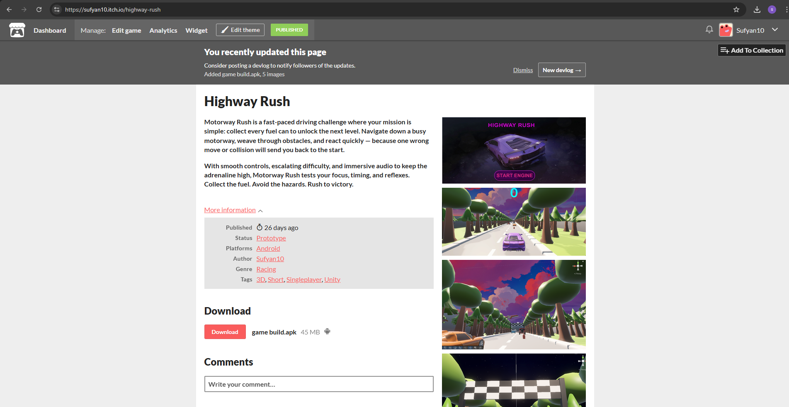

Sufyan Asif
ID: 23169032
# Mobile-Game-Development
I created a 3D car game for Android using Unity. The project focuses on smooth driving controls and an engaging 3D environment. It helped me build practical skills in Unity, C#, and mobile game development, and the final game was published on itch.io.

# Game controls and tasks 
tilts side to side 
collect 11 fuel cans to move on level
dodge cars or restart 

# Folder
In this it contains game build with APK file, unity file with assests and code 

# Git hub
During development i used github as version conrtol platform and save my work which i can access at home and can open old versions if anything gets deleted
# https://github.com/sufyabn/Mobile-Game-Development.git

# Itch.io upload link- https://sufyan10.itch.io/highway-rush
